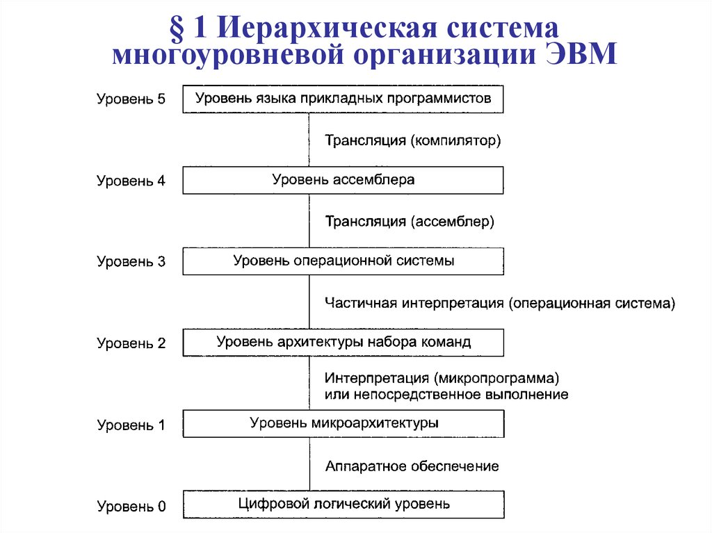

# Архитектура компьютера

## Задание 1

Объясните следующие термины своими словами:

### Транслятор
Транслятор - (микро)программа, которая полностью и взаимно-однозначно переводит программу входного языка (исходника) в программу языка-исполнителя. Каждой команде из программы исходника соответствует 
определенная команда программы исполнителя (в отличие от компиляторов, которые могут менять код по своему усмотрению). На практике трансляторами являются различные ассемблеры, а компиляторами - генераторы
машинного кода языков высокого уровня.  

### Интерпретатор
Интерпретатор - (микро)программа, которая ***построчно*** переводит программу входного языка в программу языка-исполнителя и ***тут же*** исполняет ее. Для сравнения - транслятор и компилятор сначала полностью переводят программу входного языка в программу языка-исполнителя, после чего ее можно будет исполнить.

### Виртуальная машина
Виртуальная машина - программная и/или аппаратная система, эмулирующая аппаратное обеспечение некоторой target-платформы и исполняющая программы для target-платформы на host-платформе. Применительно к главе, которую мы только что прочитали можно сказать, что виртуальная машина это программа, позволяющая писать на языке программирования так, как-будто этот язык является ***машинным***.

## Задание 2

Может ли компилятор производить данные непосредственно для уровня микроархитектуры, минуя уровень архитектуры набора команд?

